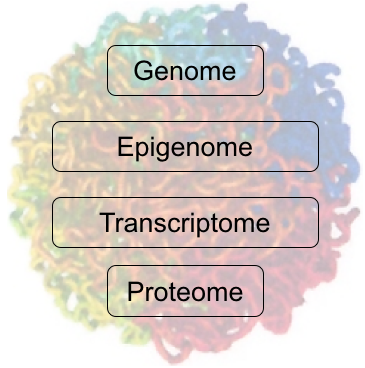
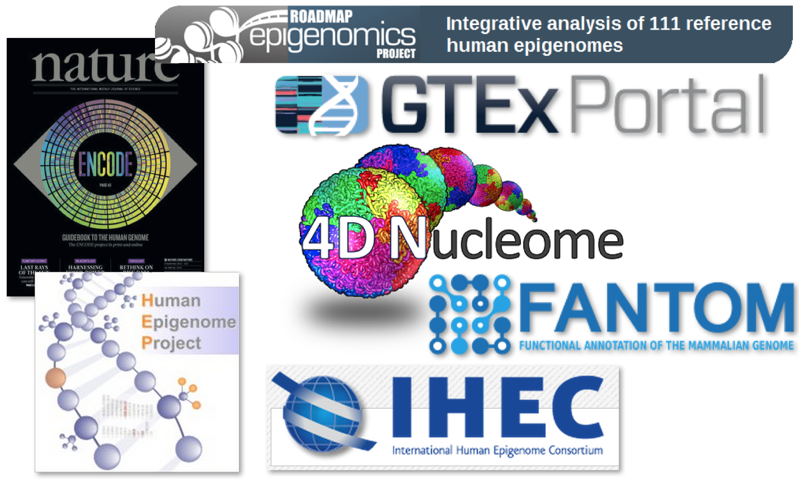
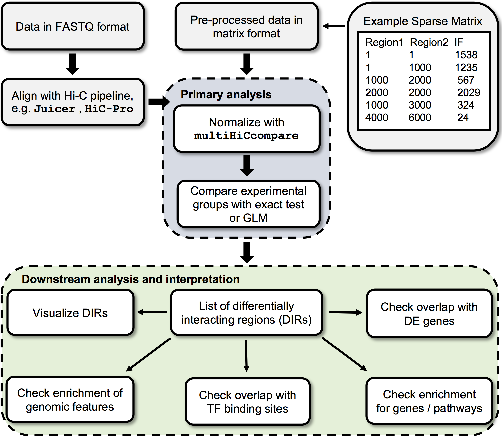
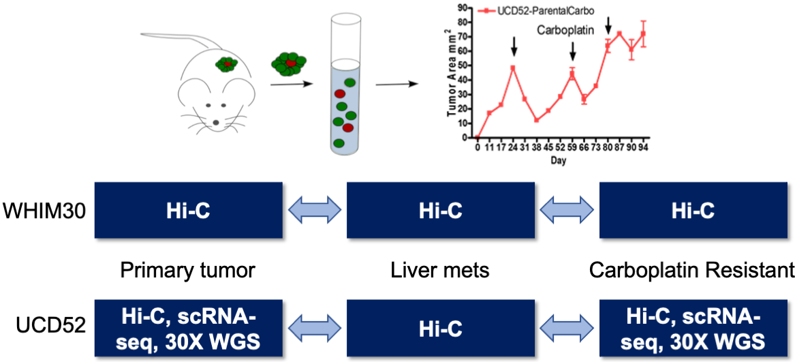
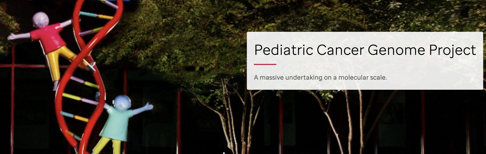
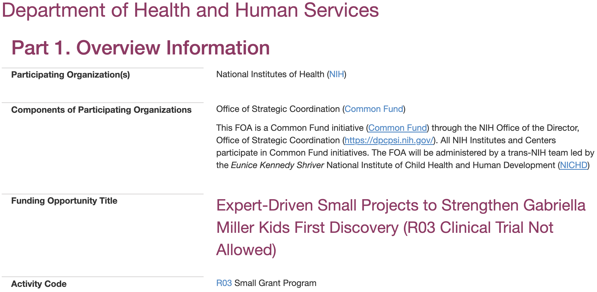
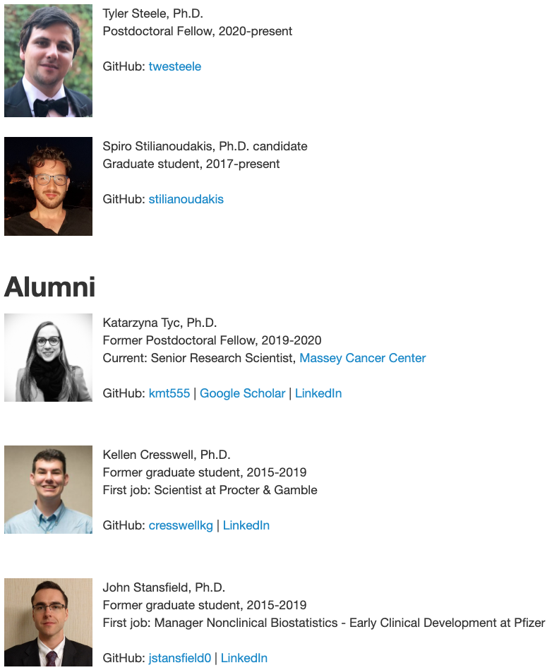

```{r xaringan-themer, include = FALSE}
library(xaringanthemer)
library(icon)
mono_light(
  base_color = "midnightblue",
  header_font_google = google_font("Noto Sans"),
  text_font_google   = google_font("Montserrat", "500", "500i"),
  code_font_google   = google_font("Droid Mono"),
  link_color = "#8B1A1A", #firebrick4, "deepskyblue1"
  text_font_size = "28px",
  code_font_size = "26px"
)
```

class: center, middle

# Bioinformatics approaches for cancer genomics

https://mdozmorov.github.io/Talk_CHRI

Mikhail Dozmorov, Ph.D.    
Biostatistics Department  
Virginia Commonwealth University  

<div class="my-footer">
<a href="https://dozmorovlab.github.io/"> `r icon::fontawesome("id-card")` dozmorovlab.github.io</a> | 
<a href="https://github.com/mdozmorov"> `r icon::fontawesome("github")` mdozmorov</a> | 
<a href="https://twitter.com/mikhaildozmorov"> `r icon::fontawesome("twitter")` @mikhaildozmorov</a>
</div>

---
## Overview

I. Integrative cancer bioinformatics for precision medicine

- Differential analysis of cancer genomes
- Collaborations in cancer genomics research

II. Bioinformatics approaches for pediatric cancers

- Resources and methods 

---
## Integrative genomics in three dimensions (3D)

.pull-left[ 
- Genome is not linear

- Rules of folding are associated with epigenomic signatures

- 3D folding enables distant enhancer-promoter interactions and gene expression regulation

- Misfolding of the genome disrupts regulatory interactions and leads to disease
]

.pull-right[ .center[] ]

---
## Methods for integrative genomics

<div style="float: left; width: 40%;">
GenomeRunner - Functional interpretation of SNPs within regulatory/epigenomic context 
<br> <br> <br> <br>
http://integrativegenomics.org/
<br> <br> <br> <br> <br>
</div>
<div style="float: right; width: 60%;">
<center></center>
 <br>
</div>

.small[ https://dozmorovlab.github.io/software.html  

Dozmorov, Mikhail G., Lukas R. Cara, Cory B. Giles, and Jonathan D. Wren. “<a href="https://dozmorovlab.github.io/">GenomeRunner Web Server: Regulatory Similarity and Differences Define the Functional Impact of SNP Sets</a>” Bioinformatics, (August 1, 2016) ]

---
## Chromosome conformation capture technologies

.pull-left[
- 3C, 4C, 5C, Hi-C   

- Capture-(Hi)C, ChIA-PET  

- Single-cell variants  

- Specialized (e.g., Methyl-HiC)
]

.pull-right[  ]

<br> &nbsp; <br> &nbsp; <br> &nbsp; <br> &nbsp; <br> &nbsp; <br> &nbsp; <br> &nbsp; <br> &nbsp; <br>

.small[ Lieberman-Aiden, Erez et al. “[Comprehensive Mapping of Long-Range Interactions Reveals Folding Principles of the Human Genome](https://doi.org/10.1126/science.1181369)” _Science_, October 9, 2009 

https://github.com/mdozmorov/HiC_tools ]

---
## Methods for 3G genomics analysis 

.pull-left[

R/Bioconductor packages for the comparative 3D genomics analysis

- **HiCcompare**, **multiHiCcompare** - normalization and differential analysis of Hi-C datasets

- **SpectralTAD**, **TADcompare** - detection of Topologically Associating Domains, differential and time course analysis

- **preciseTAD** - machine learning for 3D genomics
]
.pull-right[ .center[] ]

https://dozmorovlab.github.io/software.html


---
## Technologies for integrative genomics

- **RNA-seq** and **scRNA-seq** (single-cell)

- **ATAC-seq**, **ChIP-seq** (transcription factors, histone modifications)

- **Methylation** (array- and bisulfite sequencing)

- **Metabolomics**  (lipidomics)

&nbsp; <br> &nbsp; <br> &nbsp; <br>

.small[ https://github.com/mdozmorov/RNA-seq_notes

https://github.com/mdozmorov/scRNA-seq_notes

]

---
## Databases for integrative genomics

- **TCGA** - The Cancer Genome Atlas (TCGA)

- **METABRIC** - Molecular Taxonomy of Breast Cancer International Consortium

- **CPTAC** - Clinical Proteomic Tumor Analysis Consortium

- **CCLE** - Broad Institute Cancer Cell Line Encyclopedia

- **DepMap** - The Cancer Dependency Map Project

&nbsp; <br>

.small[ https://github.com/mdozmorov/Cancer_notes

https://github.com/mdozmorov/TCGAsurvival ]

---
## 3D genomics of breast cancer metastasis and drug resistance

- Patient Derived Xenograft (PDX) mouse models of breast cancer (J. Chuck Harrell)  

- Progression of the primary tumor to metastatic and drug resistant states

.center[]

---
## Genomic medicine publications

- Dozmorov MG. **Epigenomic annotation-based interpretation of genomic data: from enrichment analysis to machine learning**. _Bioinformatics_. 2017 Oct 15.

- Dozmorov MG. **Disease classification: from phenotypic similarity to integrative genomics and beyond**. _Brief Bioinform_. 2018 Jun 22

- Kronfol MM, Dozmorov MG, Huang R, Slattum PW, McClay JL. **The role of epigenomics in personalized medicine**. _Expert Rev Precis Med Drug Dev_. 2017

&nbsp; <br>

.small[https://dozmorovlab.github.io/publications.html]

<!---
## Collaborations

Department of Pathology

- **J. Chuck Harrell** - breast cancer, PDX models, drug discovery
- **Paula Bos** - tumor immune microenvironment, metastasis
- **Devanand Sarkar** - liver cancer
- **Anthony Faber** - lung cancer, neuroblastoma, drug discovery

Gordon Ginder, Michael Miles, Bernard Fuemmeler, Jennifer Koblinski, Larisa Litovchik, Javier Maeso, 
-->

---
class: center, middle

# Bioinformatics approaches for pediatric cancers

---
# TARGET - Therapeutically Applicable Research to Generate Effective Treatments

- Leukemia, Kidney, Neuroblastoma, Osteosarcoma
- Gene expression, copy number variation, methylation, miRNA, DNA sequencing, other
- Public and controlled access

.center[] 

https://ocg.cancer.gov/programs/target/data-matrix

---
# The Gabriella Miller Kids First Data Resource Center

- Phenotypic abnormalities (cleft lip/palate, congenital diaphragmatic hernia, etc.)
- Cancers (Neuroblastoma, Ewing's sarcoma, brain tumors)
- Whole genome/exome sequencing, genomic variants, some gene expression
- Mostly controlled access
- CAVATICA - cloud platform for Kids First data analysis

.center[] 

https://kidsfirstdrc.org/

---
# St. Jude - WashU Pediatric Cancer Genome Project

- Hematologic malignancies, brain tumors, solid tumors (neuroblastoma, Wilms' tumor, Osteosarcoma, Ewing's sarcoma)
- Gene expression, whole genome/exome sequencing
- Controlled access

.center[] 

https://www.stjude.cloud/research-domains/pediatric-cancer

---
# Opportunities to mine pediatric genomics data

.center[] 

.small[ https://grants.nih.gov/grants/guide/rfa-files/RFA-RM-21-011.html ]

---
## Acknowledgements

.pull-left[ .center[] 

.small[https://dozmorovlab.github.io/]
]

.pull-rignt[ ### Collaborations

- **J. Chuck Harrell** - breast cancer, PDX models, drug discovery
- **Paula Bos** - tumor immune microenvironment, metastasis
- **Devanand Sarkar** - liver cancer
- **Anthony Faber** - lung cancer, neuroblastoma, drug discovery

### Funding

- PhRMA Foundation grant  
- Blick scholarship (MCV foundation)

<!-- .center[] -->
]

---
class: center, middle

# Thank you

https://mdozmorov.github.io/Talk_CHRI

<div class="my-footer">
<a href="https://dozmorovlab.github.io/"> `r icon::fontawesome("id-card")` dozmorovlab.github.io</a> | 
<a href="https://github.com/mdozmorov"> `r icon::fontawesome("github")` mdozmorov</a> | 
<a href="https://twitter.com/mikhaildozmorov"> `r icon::fontawesome("twitter")` @mikhaildozmorov</a>
</div>
